\page api_guide API Guide

\section blueprints Blueprints

\subsection overview Overview

We have blueprint version for each C++ Function on each services. The blueprint function is available in two flavors.

1. As an Async Action Base single node with multiple output pin, whether it succeeds or fails
2. As a Function Library using delegate node to handle callback

### Identity Service
This is the first required service before we can proceed to platform service.

### UserLogin ###

This blueprint is similar to `JusticeIdentity::UserLogin` function. You can use this blueprint function to login with email and password. It comes with two flavors: Async Action Base and Function Library.

#### Async Action Base flavor ####

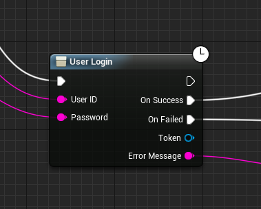

#### Function Library flavor ####

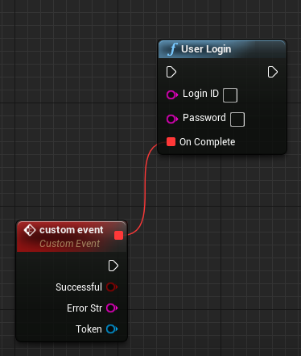

### Register New Player ###

This blueprint is similar to `JusticeIdentity::RegisterNewPlayer` function. You can use this blueprint to register new player using email and password. It comes with two flavors: Async Action Base and Function Library.

#### Async Action Base flavor ####

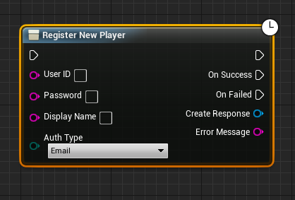

#### Function Library flavor ####
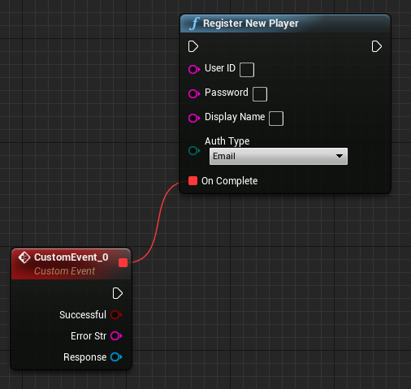

### ReissueVerificationCode ###

This blueprint is similar to `JusticeIdentity::ReissueVerificationCode` function. You can use this blueprint function to send user verification code to their email. It comes only in Async Action Base flavor.

#### Async Action Base flavor ####

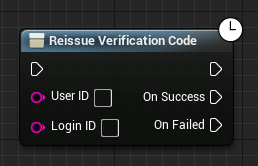

### VerifyNewPlayer ###

This blueprint is similar to `JusticeIdentity::VerifyNewPlayer` function. You can use this blueprint function to verify newly created account with verification code that user receives in their email. It comes with two flavors: Async Action Base and Function Library.

#### Async Action Base flavor ####

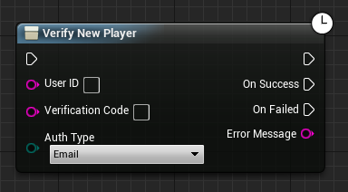

#### Function Library flavor ####


### Device Login ###

This blueprint is similar to `JusticeIdentity::DeviceLogin` function. You can use this blueprint function to login with device ID. We use value from `FGenericPlatformMisc::GetDeviceId()` as Device ID. It comes only in Async Action Base flavor.

#### Async Action Base flavor ####

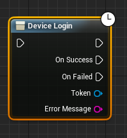

### Auth Code Login ###

This blueprint is similar to `JusticeIdentity::AuthCodeLogin` function. You can use this blueprint function to login from AccelByte's Launcher. We send authentication code from launcher, in the SDK the authentication code is grabbed for login. It comes only in Async Action Base flavor.

#### Async Action Base flavor ####

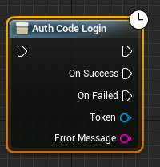

### UpgradeHeadlessAccount ### 

This blueprint is similar to `JusticeIdentity::UpgradeHeadlessAccount` function. You can use this blueprint function to upgrade headless accounts (such as from Steam, Facebook and Google) into account using email. It comes only in Async Action Base flavor.

#### Async Action Base flavor ####

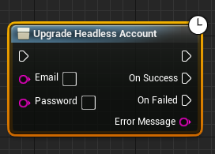

### ResetPassword ###

This blueprint is similar to `JusticeIdentity::ResetPassword` function. You can use this blueprint function to reset user’s password. User would receive verification code to reset their password. It comes with two flavors: Async Action Base and Function Library.

#### Async Action Base flavor ####

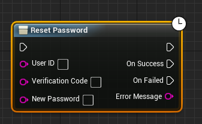

#### Function Library flavor ####

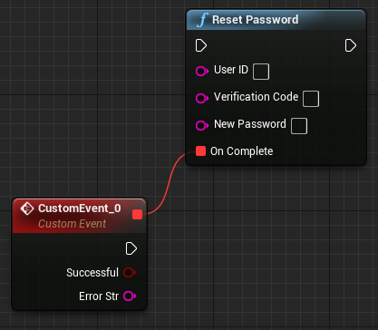

### LinkPlatform ###

This blueprint is similar to `JusticeIdentity::LinkPlatform` function. You can use this blueprint function to link your account into any platform (e.g. Steam, Google, Facebook). It comes only in Async Action Base flavor.

#### Async Action Base flavor ####
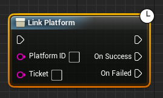

### UnlinkPlatform ###

This blueprint is similar to `JusticeIdentity::UnlinkPlatform` function. You can use this blueprint function to unlink your account from any platform (e.g. Steam, Google, Facebook). It comes only in Async Action Base flavor.

#### Async Action Base flavor ####

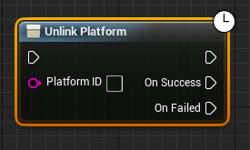

### GetLinkedPlatform ###

This blueprint is similar to `JusticeIdentity::GetLinkedPlatform` function. You can use this blueprint function to get list of platforms (e.g. Steam, Google, Facebook) linked to your account. It comes only in Async Action Base flavor.

#### Async Action Base flavor ####


### User Logout ###

This blueprint is similar to `JusticeIdentity::UserLogout` function. You can use this blueprint function to logout from current user session. It comes with two flavors: Async Action Base and Function Library.

#### Async Action Base flavor ####

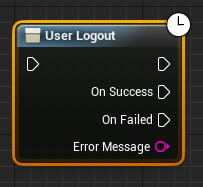

#### Function Library flavor ####

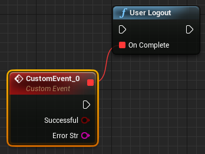

\section functions Functions

\subsection justice_identity Justice Identity

Justice Identity is the first service required before we can proceed to other service such as platform service.

* `RegisterNewPlayer`

    This function will register a new user with email-based account. It requires user's **email** (UserID), **password**, and **displayName** that will be registered through the parameter. It'll return a complete information from the user that has been registered, wrapped in UserCreateResponse object from the FRegisterPlayerCompleteDelegate callback.
```cpp
        void JusticeIdentity::RegisterNewPlayer(
            FString UserID, 
            FString Password, 
            FString DisplayName, 
            FUserAuthTypeJustice AuthType, 
            FRegisterPlayerCompleteDelegate OnComplete){}
```
    Usage:
```cpp
        void AJusticeSDKDemoGameModeBase::BeginPlay()
        {
            FString LoginID = "johnDoe@example.com";
            FString Password = "password";
            FString DisplayName = "John_Doe";
            FUserAuthTypeJustice AuthType = Email;
            JusticeIdentity::RegisterNewPlayer(LoginID, Password, DisplayName, AuthType, 
                FRegisterPlayerCompleteDelegate::CreateLambda(
                    [](bool bSuccessful, FString ErrorStr, UserCreateResponse* Response)
                    {
                        UE_LOG(LogTmp, Log, TEXT("Register User Result: %s"), bSuccessful ? TEXT("Success") : TEXT("Failed"));
                        UE_LOG(LogTmp, Log, TEXT("User's registered display name is %s"), *Response->DisplayName)
                        UE_LOG(LogTmp, Log, TEXT("User's registered UserID is %s"), *Response->UserID)
                    }
                );
            );
        }
```

* `ReissueVerificationCode`

    This function would be called after registering a new user account. This method requires user ID (**UserID**) and user email (**LoginId**) as parameters. User ID can be obtained from token response obtained after user login. It will return default callback.
```cpp
    void JusticeIdentity::ReissueVerificationCode(
        FString UserID, 
        FString LoginID, 
        FDefaultCompleteDelegate OnComplete){}
```
    Usage:
```cpp

        void AJusticeSDKDemoGameModeBase::BeginPlay()
        {
            FString UserID = "1223334444";
            FString LoginID = "johnDoe@example.com";
            FUserAuthTypeJustice AuthType = Email;
            JusticeIdentity::ReissueVerificationCode(UserID, LoginID, 
                FDefaultCompleteDelegate::CreateLambda(
                    [](bool bSuccessful, FString ErrorStr)
                    {
                        UE_LOG(LogTmp, Log, TEXT("Issue Verification Code Result: %s"), bSuccessful ? TEXT("Success") : TEXT("Failed"));
                    }
                );
            );
        }
```

* `VerifyNewPlayer`

    This function will verify the registered email **AFTER** user receives verification code sent with [ReissueVerificationCode](../functions/#reissueverificationcode) to their email. This method requires **user ID** (UserID), **VerificationCode**, and **AuthType** as parameters. It will return default callback.
```cpp
    void JusticeIdentity::VerifyNewPlayer(
        FString UserID, 
        FString VerificationCode, 
        FUserAuthTypeJustice AuthType, 
        FDefaultCompleteDelegate OnComplete){}
```
    Usage:
```cpp

        void AJusticeSDKDemoGameModeBase::BeginPlay()
        {
            FString UserID = "1223334444";
            FString VerificationCode = "13579";
            FUserAuthTypeJustice AuthType = Email;
            JusticeIdentity::VerifyNewPlayer(UserID, VerificationCode, AuthType, 
                FDefaultCompleteDelegate::CreateLambda(
                    [](bool bSuccessful, FString ErrorStr)
                    {
                        UE_LOG(LogTmp, Log, TEXT("Verify Registration Result: %s"), bSuccessful ? TEXT("Success") : TEXT("Failed"));
                    }
                );
            );
        }
```

* `UserLogin`

    Log user in with their email account. User needs to insert their **email** (LoginID) and **Password** as parameters. It will return OAuthTokenJustice from FUserLoginCompleteDelegate callback.
```cpp
    void JusticeIdentity::UserLogin(
        FString LoginID, 
        FString Password, 
        FUserLoginCompleteDelegate OnComplete)
```
    Usage:
```cpp

        void AJusticeSDKDemoGameModeBase::BeginPlay()
        {
            FString LoginID = "johnDoe@example.com";
            FString Password = "password";
            JusticeIdentity::UserLogin(LoginID, Password, 
                FUserLoginCompleteDelegate::CreateLambda(
                    [](bool bSuccessful, FString ErrorStr, *OAuthTokenJustice Token)
                    {
                        UE_LOG(LogTmp, Log, TEXT("User Login with Email Result: %s"), bSuccessful ? TEXT("Success") : TEXT("Failed"));
                        UE_LOG(LogTmp, Log, TEXT("User's Display Name is %s"), *Token->DisplayName);
                    }
                );
            );
        }
```

* `DeviceLogin`

    This function allows user to login without entering any information, it'll automatically obtain their device's information for their account. It will return OAuthTokenJustice from FUserLoginCompleteDelegate callback.

```cpp
        void JusticeIdentity::DeviceLogin(FUserLoginCompleteDelegate OnComplete){}
```
    Usage:
```cpp
        void AJusticeSDKDemoGameModeBase::BeginPlay()
        {
            JusticeIdentity::DeviceLogin(FUserLoginCompleteDelegate::CreateLambda(
                [](bool bSuccessful, FString ErrorStr, *OAuthTokenJustice Token)
                {
                    UE_LOG(LogTmp, Log, TEXT("User Login with Device: %s"), bSuccessful ? TEXT("Success") : TEXT("Failed"));
                    UE_LOG(LogTmp, Log, TEXT("User's Display Name is %s"), *Token->DisplayName);
                }
            ););
        }
```

* `AuthCodeLogin`

    This function will login the user automatically from Justice Launcher with their account on Justice Launcher too. **AuthCode** parameter should be filled with "JUSTICE_AUTHORIZATION_CODE" environment variable. **RedirectURI** is optional. This function will return OAuthTokenJustice from FUserLoginCompleteDelegate callback.
```cpp
        void JusticeIdentity::AuthCodeLogin(FString AuthCode, FString RedirectURI, FUserLoginCompleteDelegate OnComplete){}
```
    Usage:
```cpp
        void AJusticeSDKDemoGameModeBase::BeginPlay()
        {
            FString AuthCode = "0123456789";
            FString RedirectURI = "https://example.com";
            JusticeIdentity::AuthCodeLogin(AuthCode, RedirectURI, FUserLoginCompleteDelegate::CreateLambda(
                [](bool bSuccessful, FString ErrorStr, *OAuthTokenJustice Token)
                {
                    UE_LOG(LogTmp, Log, TEXT("User Login with Authorization Code (Launcher) Result: %s"), bSuccessful ? TEXT("Success") : TEXT("Failed"));
                    UE_LOG(LogTmp, Log, TEXT("User's Display Name is %s"), *Token->DisplayName);
                }
            ););
        }
```

* `UpgradeHeadlessAccount`

    This function will upgrade user's headless account. Headless account is an account that doesn't have an email-password. If user logs in with a device/platform and they cannot login with email-and-password, their account is considered as a headless account. Therefore, the function requests user’s **Email** and **Password** for parameters. It will return default callback.
```cpp
        void JusticeIdentity::UpgradeHeadlessAccount(FString Email, FString Password, FDefaultCompleteDelegate OnComplete){}
```
    Usage:
```cpp
        void AJusticeSDKDemoGameModeBase::BeginPlay()
        {
            // Login with device first if you want to upgrade it with email and password

            FString Email = "johnDoe@example.com";
            FString Password = "password";
            JusticeIdentity::UpgradeHeadlessAccount(Email, Password, FDefaultCompleteDelegate::CreateLambda(
                [](bool bSuccessful, FString ErrorStr)
                {
                    UE_LOG(LogTmp, Log, TEXT("User Upgrade Headless Account Result: %s"), bSuccessful ? TEXT("Success") : TEXT("Failed"));
                }
            ););
        }
```

* `ForgotPassword`

    Send a request to reset user's password. This function requires user's email to reset their password. It requires email as **LoginID** parameter. It will return default callback.
```cpp
        void JusticeIdentity::ForgotPassword(FString LoginID, FDefaultCompleteDelegate OnComplete){}
```
    Usage:
```cpp
        void AJusticeSDKDemoGameModeBase::BeginPlay()
        {
            FString LoginID = "johnDoe@example.com";
            JusticeIdentity::ForgotPassword(LoginID, FDefaultCompleteDelegate::CreateLambda(
                [](bool bSuccessful, FString ErrorStr)
                {
                    UE_LOG(LogTmp, Log, TEXT("User Request to Reset Password Result: %s"), bSuccessful ? TEXT("Success") : TEXT("Failed"));
                }
            ););
        }
```

* `ResetPassword`

    This function verifies user's [request to reset password](#forgotpassword). User should insert their **email** (UserID), **VerificationCode** sent to their email, and **NewPassword** as parameters. It will return default callback.

```cpp
        void JusticeIdentity::ResetPassword(FString UserID, FString VerificationCode, FString NewPassword, FDefaultCompleteDelegate OnComplete){}
```
    Usage:
```cpp
        void AJusticeSDKDemoGameModeBase::BeginPlay()
        {
            FString VerificationCode = "123456";
            FString UserID = "johnDoe@example.com";
            FString NewPassword = "freshPassword";
            JusticeIdentity::ResetPassword(UserID, VerificationCode, NewPassword, FDefaultCompleteDelegate::CreateLambda(
                [](bool bSuccessful, FString ErrorStr)
                {
                    UE_LOG(LogTmp, Log, TEXT("User Reset Password Result: %s"), bSuccessful ? TEXT("Success") : TEXT("Failed"));
                }
            ););
        }
```
* `LinkPlatform`

    This function links user's current account to their other account in other platform. The required parameters are **PlatformID** and **Ticket**. Ticket for each platform (PlatformToken) can be obtained from browser with platform linking URL (e.g. Facebook, Google, Twitch platform). The browser will redirect the url to a site with a code in form of parameter URL. This function will return default callback.
```cpp
        void JusticeIdentity::LinkPlatform(FString PlatformID, FString Ticket, FDefaultCompleteDelegate OnComplete){}
```
    Usage:
```cpp
    
        void AJusticeSDKDemoGameModeBase::BeginPlay()
        {
            // Login user first

            FString PlatformID = "facebook";
            FString Ticket = "0123456789";
            JusticeIdentity::LinkPlatform(PlatformID, Ticket, FDefaultCompleteDelegate::CreateLambda(
                [](bool bSuccessful, FString ErrorStr)
                {
                    UE_LOG(LogTmp, Log, TEXT("User Linking Account Result: %s"), bSuccessful ? TEXT("Success") : TEXT("Failed"));
                }
            ););
        }
```
* `UnlinkPlatform`

    This function unlinks user's platform account that is linked with user’s current account. It only requires **PlatformID** as the parameter to unlink user’s platform account. It will return default callback.

```cpp
        void JusticeIdentity::UnlinkPlatform(FString PlatformID, FDefaultCompleteDelegate OnComplete){}
```
    Usage:
```cpp
        void AJusticeSDKDemoGameModeBase::BeginPlay()
        {
            // Login user first

            FString PlatformID = "facebook";
            JusticeIdentity::UnlinkPlatform(PlatformID, FDefaultCompleteDelegate::CreateLambda(
                [](bool bSuccessful, FString ErrorStr)
                {
                    UE_LOG(LogTmp, Log, TEXT("User Unlinking Account Result: %s"), bSuccessful ? TEXT("Success") : TEXT("Failed"));
                }
            ););
        }
```

* `GetLinkedUserPlatform`

    This function gets user's platform accounts linked to user’s account. It doesn't need any parameter. It will return a TArray<LinkedPlatform> from FGetLinkedPlatformCompleteDelegate callback.
```cpp
        void JusticeIdentity::GetLinkedPlatform(FGetLinkedPlatformCompleteDelegate OnComplete){}
```
    Usage:
```cpp
        void AJusticeSDKDemoGameModeBase::BeginPlay()
        {
            // Login user first

            JusticeIdentity::GetLinkedPlatform(FGetLinkedPlatformCompleteDelegate::CreateLambda(
                [](bool bSuccessful, FString ErrorStr, TArray<LinkedPlatform> LinkedPlatforms)
                {
                    UE_LOG(LogTmp, Log, TEXT("User Get Linked Account Result: %s"), bSuccessful ? TEXT("Success") : TEXT("Failed"));
                    UE_LOG(LogTmp, Log, TEXT("Found Linked Account: %d"), LinkedPlatforms.Num());
                }
            ););
        }
```
* `Logout`

    Log user out from the game. It doesn't require any parameter. It will return default callback.
```cpp
        void JusticeIdentity::UserLogout(FDefaultCompleteDelegate OnComplete)
```
    Usage:
```cpp
        void AJusticeSDKDemoGameModeBase::BeginPlay()
        {
            // Login user first

            JusticeIdentity::UserLogout(FDefaultCompleteDelegate::CreateLambda(
                [](bool bSuccessful, FString ErrorStr)
                {
                    UE_LOG(LogTmp, Log, TEXT("User Logout Result: %s"), bSuccessful ? TEXT("Success") : TEXT("Failed"));
                }
            ););
        }
```

\subsection platform_service Platform Service

User should log in to use the platform. Please refer to [Justice Identity](#justice-identity) to see how to log user in.

\subsubsection justice_catalog Justice Catalog

* `GetCategory`

    This function gets the category from a store in a namespace. The required parameter is **ParentPath** and the optional parameter is **Language**. It'll return the TArray<Category> from the FCategoryDefaultCompleteDelegate callback.
```cpp
    
        void JusticeCatalog::GetCategory(
            FString ParentPath, 
            FString Language, 
            FCategoryDefaultCompleteDelegate OnComplete){}
```
    Usage:
```cpp
    
        void AJusticeSDKDemoGameModeBase::BeginPlay()
        {
            FString ParentPath = "/game/weapon/example";
            FString Language = "en";
            JusticeCatalog::GetCategory(ParentPath, Language,
                FCategoryDefaultCompleteDelegate::CreateLambda(
                    [](bool bSuccessful, FString ErrorStr, TArray<Category> Result)
                    {
                        UE_LOG(LogTmp, Log, TEXT("Get Category Result: %s"), bSuccessful ? TEXT("Success") : TEXT("Failed"));
                        UE_LOG(LogTmp, Log, TEXT("Category Found : %d"), Result.Num());                        
                    }
                );
            );
        }
```
* `GetRootCategory`

    This function gets root categories that exist in the same namespace with user's namespace. The optional parameter is **Language**. It'll return the root TArray<Category> from the FCategoryDefaultCompleteDelegate callback.
```cpp
    
        void JusticeCatalog::GetRootCategory(FString Language, FCategoryDefaultCompleteDelegate OnComplete){}
```
    Usage:
```cpp
        void AJusticeSDKDemoGameModeBase::BeginPlay()
        {
            FString Language = "en";
            JusticeCatalog::GetRootCategory(Language,
                FCategoryDefaultCompleteDelegate::CreateLambda(
                    [](bool bSuccessful, FString ErrorStr, TArray<Category> Result)
                    {
                        UE_LOG(LogTmp, Log, TEXT("Get Root Category Result: %s"), bSuccessful ? TEXT("Success") : TEXT("Failed"));
                        UE_LOG(LogTmp, Log, TEXT("Root Category Found : %d"), Result.Num());                        
                    }
                );
            );
        }
```

* `GetChildCategory`

    This function gets the subcategories from a category. This method requires the parent path / **CategoryPath** parameter and optional **Language** parameter. It'll return a subcategory TArray<Category> from the FCategoryDefaultCompleteDelegate callback.
```cpp
        void JusticeCatalog::GetChildCategory(
            FString Language, 
            FString CategoryPath, 
            FCategoryDefaultCompleteDelegate OnComplete){}
```
    Usage:
```cpp
        void AJusticeSDKDemoGameModeBase::BeginPlay()
        {
            FString Language = "en";
            FString CategoryPath = "/game/weapon";
            JusticeCatalog::GetChildCategory(Language, CategoryPath,
                FCategoryDefaultCompleteDelegate::CreateLambda(
                    [](bool bSuccessful, FString ErrorStr, TArray<Category> Result)
                    {
                        UE_LOG(LogTmp, Log, TEXT("Get Child Category Result: %s"), bSuccessful ? TEXT("Success") : TEXT("Failed"));
                        UE_LOG(LogTmp, Log, TEXT("Child Category Found : %d"), Result.Num());                        
                    }
                );
            );
        }
```

* `GetDescendantCategory`

    Get every subcategories from a category. The required parameter is **CategoryPath** and the optional parameter is **Language**. It'll return a descendant TArray<Category> from the FCategoryDefaultCompleteDelegate callback.
```cpp
        void JusticeCatalog::GetDescendantCategory(
            FString Language, 
            FString CategoryPath, 
            FCategoryDefaultCompleteDelegate OnComplete){}
```
    Usage:
```cpp
        void AJusticeSDKDemoGameModeBase::BeginPlay()
        {
            FString Language = "en";
            FString CategoryPath = "/game/potion";
            JusticeCatalog::GetDescendantCategory(Language, CategoryPath,
                FCategoryDefaultCompleteDelegate::CreateLambda(
                    [](bool bSuccessful, FString ErrorStr, TArray<Category> Result)
                    {
                        UE_LOG(LogTmp, Log, TEXT("Get Descendant Category Result: %s"), bSuccessful ? TEXT("Success") : TEXT("Failed"));
                        UE_LOG(LogTmp, Log, TEXT("Descendant Category Found: %d"), Result.Num());                        
                    }
                );
            );
        }
```

* `GetItem`

    Get an item information from a store within the user's namespace. The required parameters are **ItemID** and **Region**. The optional parameter is **Language**. It'll return an ItemInfo from the FGetItemCompleteDelegate callback.
```cpp
        void JusticeCatalog::GetItem(
            FString ItemID, 
            FString Region, 
            FString Language, 
            FGetItemCompleteDelegate OnComplete){}
```
    Usage:
```cpp
        void AJusticeSDKDemoGameModeBase::BeginPlay()
        {
            FString ItemID = "123456789";
            FString Region = "US";
            FString Language = "en";
            JusticeCatalog::GetItem(ItemID, Region, Language,
                FGetItemCompleteDelegate::CreateLambda(
                    [](bool bSuccessful, FString ErrorStr, ItemInfo Result)
                    {
                        UE_LOG(LogTmp, Log, TEXT("Get Item Result: %s"), bSuccessful ? TEXT("Success") : TEXT("Failed"));
                        UE_LOG(LogTmp, Log, TEXT("Item name: %s"), *Result->Title;
                    }
                );
            );
        }
```

* `GetItemByQuery`

    Get an array of items with specific criteria/filter from a store within user's namespace. All parameters are required, except **Language** paramater. This function will return a TArray<ItemInfo> that fulfilled the criteria from the FItemCompleteDelegate callback.
```cpp
        void JusticeCatalog::GetItemByQuery(
            FString Language, 
            FString Region, 
            FString CategoryPath, 
            FString ItemType, 
            FString Status, 
            int32 Page, 
            int32 Size, 
            FItemCompleteDelegate OnComplete){}
```
    Usage:
```cpp
        void AJusticeSDKDemoGameModeBase::BeginPlay()
        {
            FString Language = "en";
            FString Region = "US";
            FStri / CategoryPath parameter and option/armour";
            FString ItemType = "";
            FString Status = "ACTIVE";
            FString Page = "0";
            FString Size = "5";
            JusticeCatalog::GetItemByQuery(Language, Region, CategoryPath, ItemType, Status, Page, Size, 
                FItemCompleteDelegate::CreateLambda(
                    [](bool bSuccessful, FString ErrorStr, TArray<ItemInfo> Result)
                    {
                        UE_LOG(LogTmp, Log, TEXT("Get Item by Query Result: %s"), bSuccessful ? TEXT("Success") : TEXT("Failed"));
                        UE_LOG(LogTmp, Log, TEXT("Item found: %d"), Result.Num();
                    }
                );
            );
        }
```

\subsection justice_purchase Justice Purchase

* `CreateNewOrder`

    Create order to purchase something from the store. It requires all parameters (**ItemID**, **Price**, **DiscountedPrice**, and **Currency**. It'll return OrderInfo from the FOrderInfoCompleteDelegate callback.
```cpp
        void JusticePurchase::CreateNewOrder(
            FString ItemID, 
            int32 Price, 
            int32 DiscountedPrice, 
            FString Currency, 
            FOrderInfoCompleteDelegate OnComplete){}
```
    Usage:
```cpp
        void AJusticeSDKDemoGameModeBase::BeginPlay()
        {
            FString ItemID = "0123456789";
            int32 Price = 10;
            int32 DiscountedPrice = "8";
            FString Currency = "USD";
            JusticePurchase::CreateNewOrder(ItemID, Price, DiscountedPrice, Currency, 
                FOrderInfoCompleteDelegate::CreateLambda(
                    [](bool bSuccessful, FString ErrorStr, OrderInfo Result)
                    {
                        UE_LOG(LogTmp, Log, TEXT("Create Order Result: %s"), bSuccessful ? TEXT("Success") : TEXT("Failed"));
                        UE_LOG(LogTmp, Log, TEXT("Order Number: %s"), *Result->OrderNo;
                    }
                );
            );
        }
```

* `GetUserOrder`

    Get user's order information. It requires the order's number (**OrderNo**) as parameter. It'll return an OrderInfo from the FOrderInfoCompleteDelegate callback.
```cpp
        void JusticePurchase::GetUserOrder(
            FString OrderNo, 
            FOrderInfoCompleteDelegate OnComplete){}
```
    Usage:
```cpp
        void AJusticeSDKDemoGameModeBase::BeginPlay()
        {
            FString OrderNo = "1223334444";
            JusticePurchase::GetUserOrder(OrderNo, 
                FOrderInfoCompleteDelegate::CreateLambda(
                    [](bool bSuccessful, FString ErrorStr, OrderInfo Result)
                    {
                        UE_LOG(LogTmp, Log, TEXT("Get User Order Result: %s"), bSuccessful ? TEXT("Success") : TEXT("Failed"));
                        UE_LOG(LogTmp, Log, TEXT("Order's Item ID: %s"), *Result->ItemID;
                    }
                );
            );
        }
```

* `GetUserOrders`

    Get all of user's orders that have been created. It has two optional parameters; **Page** and **Size**. It'll return a TArray<OrderInfo> from the FGetUserOrdersCompleteDelegate callback.
```cpp
        void JusticePurchase::GetUserOrders(
            int32 Page, 
            int32 Size, 
            FGetUserOrdersCompleteDelegate OnComplete){}
```
    Usage:
```cpp
        void AJusticeSDKDemoGameModeBase::BeginPlay()
        {
            int32 Page = "0";
            int32 Size = "20";
            JusticePurchase::GetUserOrders(Page, Size,
                FOrderInfoCompleteDelegate::CreateLambda(
                    [](bool bSuccessful, FString ErrorStr, TArray<OrderInfo> Result)
                    {
                        UE_LOG(LogTmp, Log, TEXT("Get User Orders Result: %s"), bSuccessful ? TEXT("Success") : TEXT("Failed"));
                        UE_LOG(LogTmp, Log, TEXT("User's order found : %d"), Result.Num();
                    }
                );
            );
        }
```

* `GetUserOrderHistory`

    Get the history of the created orders. It requires an **OrderNo** parameter. It'll return an TArray<OrderHistoryInfo> from the FGetUserOrderHistoryCompleteDelegate callback.
```cpp
        void JusticePurchase::GetUserOrderHistory(
            FString OrderNo, 
            FGetUserOrderHistoryCompleteDelegate OnComplete){}
```
    Usage:
```cpp
        void AJusticeSDKDemoGameModeBase::BeginPlay()
        {
            FString OrderNo = "1223334444";
            JusticePurchase::GetUserOrderHistory(OrderNo, 
                FGetUserOrderHistoryCompleteDelegate::CreateLambda(
                    [](bool bSuccessful, FString ErrorStr, TArray<OrderHistoryInfo> Result)
                    {
                        UE_LOG(LogTmp, Log, TEXT("Get User Order History Result: %s"), bSuccessful ? TEXT("Success") : TEXT("Failed"));
                        UE_LOG(LogTmp, Log, TEXT("Found %d order history."), Result.Num();
                    }
                );
            );
        }
```

* `FulfillOrder`

    Fulfill user's order. The required parameter is **OrderNo**. It'll return an OrderInfo from the FOrderInfoCompleteDelegate callback.
```cpp
        
        void JusticePurchase::FulfillOrder(
            FString OrderNo, 
            FOrderInfoCompleteDelegate OnComplete){}
```
    Usage:
```cpp
        void AJusticeSDKDemoGameModeBase::BeginPlay()
        {
            FString OrderNo = "1223334444";
            JusticePurchase::FulfillOrder(OrderNo, 
                FOrderInfoCompleteDelegate::CreateLambda(
                    [](bool bSuccessful, FString ErrorStr, OrderInfo Result)
                    {
                        UE_LOG(LogTmp, Log, TEXT("Fulfill User Order Result: %s"), bSuccessful ? TEXT("Success") : TEXT("Failed"));
                        UE_LOG(LogTmp, Log, TEXT("Item ID that fulfilled is %s."), *Result->ItemID;
                    }
                );
            );
        }
```

\subsubsection justice_wallet Justice Wallet

* `GetWalletBalance`

    Get user's wallet information for a specific currency code. It requires **CurrencyCode** as a parameter. It'll return an **integer** number of the wallet's balance from the FGetWalletBalanceCompleteDelegatecallback.
```cpp
        void JusticeWallet::GetWalletBalance(
            FString CurrencyCode, 
            FGetWalletBalanceCompleteDelegate OnComplete){}
```
    Usage:
```cpp
        void AJusticeSDKDemoGameModeBase::BeginPlay()
        {
            FString CurrencyCode = "USD";
            JusticeWallet::GetWalletBalance(CurrencyCode, 
                FGetWalletBalanceCompleteDelegate::CreateLambda(
                    [](bool bSuccessful, FString ErrorStr, int32 Balance)
                    {
                        UE_LOG(LogTmp, Log, TEXT("Get Wallet Result: %s"), bSuccessful ? TEXT("Success") : TEXT("Failed"));
                        UE_LOG(LogTmp, Log, TEXT("Wallet balance is %d."), *Balance;
                    }
                );
            );
        }
```
\subsubsection user_profile User Profile

* `RequestCurrentPlayerProfile`

    Get user's profile information. The profile should exists. It doesn't require any parameter. It'll return the UserProfileInfo from the FReqestCurrentPlayerProfileCompleteDelegate callback.
```cpp
        void JusticePlatform::RequestCurrentPlayerProfile(
            FReqestCurrentPlayerProfileCompleteDelegate OnComplete){}
```
    Usage:
```cpp
        void AJusticeSDKDemoGameModeBase::BeginPlay()
        {
            JusticePlatform::RequestCurrentPlayerProfile( 
                FReqestCurrentPlayerProfileCompleteDelegate::CreateLambda(
                    [](bool bSuccessful, FString ErrorStr, UserProfileInfo Result)
                    {
                        UE_LOG(LogTmp, Log, TEXT("Get User's Profile Result: %s"), bSuccessful ? TEXT("Success") : TEXT("Failed"));
                        UE_LOG(LogTmp, Log, TEXT("User's display name is %s."), *Result->DisplayName;
                    }
                );
            );
        }
```

* `CreateDefaultPlayerProfile`

    Create user's minimum profile information. It requires two parameters to be filled: **Email** and **DisplayName**. It will return default callback.
```cpp
        void JusticePlatform::CreateDefaultPlayerProfile(
            FString Email, 
            FString DisplayName, 
            FDefaultCompleteDelegate OnComplete){}
```
    Usage:
```cpp
        void AJusticeSDKDemoGameModeBase::BeginPlay()
        {
            FString Email = "johndoe@example.com";
            FString DisplayName = "JohnD03";
            JusticePlatform::CreateDefaultPlayerProfile(Email, DisplayName, 
                FDefaultCompleteDelegate::CreateLambda(
                    [](bool bSuccessful, FString ErrorStr)
                    {
                        UE_LOG(LogTmp, Log, TEXT("Create Default Profile Result: %s"), bSuccessful ? TEXT("Success") : TEXT("Failed"));
                    }
                );
            );
        }
```

* `UpdatePlayerProfile`

    Update user's current profile information. The profile should exist. It requires an object (**UserProfileInfoUpdate**) as the parameter. It will return default callback.
```cpp
        void JusticePlatform::UpdatePlayerProfile(
            UserProfileInfoUpdate newUserProfile, 
            FDefaultCompleteDelegate OnComplete)
```
    Usage:
```cpp
        void AJusticeSDKDemoGameModeBase::BeginPlay()
        {
            UserProfileInfoUpdate NewUserProfile;
            NewUserProfile.Email = "johndoe@example.com";
            NewUserProfile.DisplayName = "JohnDoe";
            NewUserProfile.AvatarLargeUrl = "https://example.com/large.jpg";
            NewUserProfile.AvatarUrl = "https://example.com/medium.jpg";
            NewUserProfile.AvatarSmallUrl = "https://example.com/small.jpg";
            NewUserProfile.FirstName = "John";
            NewUserProfile.LastName = "Doe";
            NewUserProfile.Language = "en";
            NewUserProfile.Timezone = "Asia/Shanghai";
            NewUserProfile.DateOfBirth = "2002-02-02";
            
            JusticePlatform::UpdatePlayerProfile(NewUserProfile, 
                FDefaultCompleteDelegate::CreateLambda(
                    [](bool bSuccessful, FString ErrorStr)
                    {
                        UE_LOG(LogTmp, Log, TEXT("Update Player Profile Result: %s"), bSuccessful ? TEXT("Success") : TEXT("Failed"));
                    }
                );
            );
        }
```

\section models Models

## FBalanceInfo

|Field|Type|Description|
|---|---|---|
ID              |FString    |User ID that owns this balance.
WalletID        |FString    |Wallet ID from the balance.
CurrencyCode    |FString    |Currency code from the balance (e.g. USD)
Balance         |int32      |Amount of the balance.
BalanceSource   |FString    |Balance's source.
CreatedAt       |FString    |Balance creation time.
UpdatedAt       |FString    |Latest balance update time.
Status          |FString    |Status of the balance.

## FCategory

|Field|Type|Description|
|---|---|---|
Namespace           |FString    |Category's namespace.
ParentCategoryPath  |FString    |Hold category's parent's path.
CategoryPath        |FString    |Current category's path.
DisplayName         |FString    |Category's display name.
CreatedAt           |FString    |Category creation time.
UpdatedAt           |FString    |Category latest update time.
Root                |bool       |Is this category is a root category?

## FCurrencySummary

|Field|Type|Description|
|---|---|---|
CurrencyCode    |FString|The code of the currency
CurrencySymbol  |FString|The symbol of the currency.
CurrencyType    |FString|The type of the currency ('REAL', 'VIRTUAL')
Namespace       |FString|The namespace of the currency.
Decimals        |int32  |The decimals number of the currency.

## FItemInfo

|Field|Type|Description|
|---|---|---|
Title               |FString     |Item's title
Description         |FString     |Item's description
LongDescription     |FString     |Item's long description
Images              |TArray<FJusticeImage>    |Item's image(s)
ThumbnailImage      |FJusticeImage     |Item's thumbnail
ItemID              |FString     |Item's ID
AppID               |FString     |App ID for the item.
AppType             |FString     |App type for the item.
SKU                 |FString     |Item's SKU.
Namespace           |FString     |Item's namespace.
EntitlementName     |FString     |Item's entitlement name.
EntitlementType     |FString     |Item's entitlement type.
UseCount            |int32       |Item's usage count.
CategoryPath        |FString     |Category path containing the item.
Status              |FString     |Item's status.
ItemType            |FString     |Item's type.
CreatedAt           |FString     |Item's creation time.
UpdatedAt           |FString   |Item latest update time.
TargetCurrencyCode  |FString     |Item's target currency code.
TargetNamespace     |FString     |Item's target namespace.
RegionData          |TArray<FRegionData>|Region data of this item.
ItemIds             |TArray< FString>   |Array of item IDs if this item is a bundle item.
Tags                |TArray< FString>   |Item's tag(s).

## FItemPagingSlicedResult

|Field|Type|Description|
|---|---|---|
Data    |TArray<FItemInfo>|Array of items in the result page.
Paging  |FPaging|Paging system from the result.

## FJusticeImage

|Field|Type|Description|
|---|---|---|
Height          |int32  |Image's height in pixel.
Width           |int32  |Image's width in pixel.
ImageURL        |FString|Image's URL.
SmallImageURL   |FString|Small image's URL.

## FLinkedPlatform

|Field|Type|Description|
|---|---|---|
PlatformID      |FString|ID of the platform linked to user.
PlatformUserID  |FString|User ID that links the user to platform.
Namespace       |FString|Namespace of the linked account.
UserID          |FString|User ID that is linked to platform.

## FOAuthTokenJustice

|Field|Type|Description|
|---|---|---|
AccessToken     |FString|Client's access token.
UserRefreshToken|FString|Client's refresh token.
TokenType       |FString|Type of token.
ExpiresIn       |double|Token expiration time.
Permissions     |TArray<FPermissionJustice>|Permission(s) of the client.
Roles           |TArray< FString>|Role(s) of the client.
Bans            |TArray< FString>|Ban(s) of the client.
UserID          |FString|ID of the client.
DisplayName     |FString|Display name of the client.
Namespace       |FString|Namespace of the client.
LastTokenRefreshUtc|FDateTime|
NextTokenRefreshUtc|FDateTime|
TokenRefreshBackoff|FTimespan|
JFlags          |int32|

## FOrderCreate

|Field|Type|Description|
|---|---|---|
ItemID          |FString|ID of item ordered.
Quantity        |FString|Quantity of item ordered.
Price           |int32  |Total price of item ordered.
DiscountedPrice |int32  |Total price of item ordered after discount.
CurrencyCode    |FString|The currency code of item ordered.
ReturnURL       |FString|URL that is opened after order is fulfilled.

## FOrderHistoryInfo

|Field|Type|Description|
|---|---|---|
OrderNo     |FString     |Order's number.
Operator    |FString     |Operator of the order.
Action      |FString     |Order's current action.
Reason      |FString     |Order's reason.
UserID      |FString     |ID of user dealing with this order.
CreatedAt   |FString     |Order's creation time.
UpdatedAt   |FString     |Order latest update time.

## FOrderInfo

|Field|Type|Description|
|---|---|---|
OrderNo             |FString    |Order's number.
UserID              |FString    |ID of user that creates this order.
ItemID              |FString    |Item's ID included in this order.
bSandBox            |bool       |Is this order sandbox mode?
Quantity            |int32      |The amount of item ordered.
Price               |int32      |Item's price.
DiscountedPrice     |int32      |Item's discounted price.
Vat                 |int32      |Order's VAT.
SalesTax            |int32      |Order's sales tax.
PaymentProviderFee  |int32      |Payment provider fee for this order.
PaymentMethodFee    |int32      |Payment method fee for this order.
Currency            |FCurrencySummary|Currency used in this order.
PaymentURL          |FPaymentURL|Order's payment information.
PaymentStationURL   |FString    |URL used to pay this order.
Transactions        |TArray<FTransaction>|Order's transaction step.
EntitlementIds      |TArray< FString>   |Entitlement ID from this order.
Status              |FString    |Order's status.
StatusReason        |FString    |Reason for order's status.
Namespace           |FString    |Namespace of this order.
CreatedTime         |FString    |Order creation time.
ChargedTime         |FString    |Order charging time.
FulfilledTime       |FString    |Order fulfilling time.
RefundedTime        |FString    |Order refunding time.
CreatedAt           |FString    |Order creation time.
UpdatedAt           |FString    |Order latest activity.

## FOrderInfoPaging

|Field|Type|Description|
|---|---|---|
Data    |TArray<FOrderInfo>|Array of orders' informations in the result page.
PagingInfo  |FPaging|Paging system from the result.

## FPaging

|Field|Type|Description|
|---|---|---|
Previous    |FString|Previous page.
Next        |FString|Next page.

## FPaymentURL

|Field|Type|Description|
|---|---|---|
PaymentProvider |FString |Provider of this payment.
PaymentURL      |FString |URL to continue the payment.
PaymentToken    |FString |Payment's token.
ReturnURL       |FString |URL returned from OrderCreate
PaymentType     |FString |Payment's type.

## FPermissionJustice

|Field|Type|Description|
|---|---|---|
Resource    |FString|Resource of the permission.
Action      |int32  |Code number for the possible action.

## FPrice

|Field|Type|Description|
|---|---|---|
Value       |int32   |Price value.
CurrencyCode|FString |Code of currency for this price.
CurrencyType|FString |Type of the currency.
Namespace   |FString |Namespace of the currency.

## FRegionData

|Field|Type|Description|
|---|---|---|
Price                       |int32      |Price of item in this region.
DiscountPercentage          |int32      |Percentage of the discount for item in this region.
DiscountAmount              |int32      |Amount of discount for item in this region.
DiscountedPrice             |int32      |Price of item after discounted in this region.
CurrencyCode                |FString    |Code of currency used for the item in this region.
CurrencyType                |FString    |Type of currency for item in this region.
CurrencyNamespace           |FString    |Namespace of currency used.
PurchaseAt                  |FString    |Item purchase time.
ExpireAt                    |FString    |Item expiration time.
TotalNum                    |int32      |Item amount.
TotalNumPerAccount          |int32      |Amount of item per user.
DiscountPurchaseAt          |FString    |Discount purchasing time.
DiscountExpireAt            |FString    |Discount expiration time.
DiscountTotalNum            |int32      |Total discount amount.
DiscountTotalNumPerAccount  |int32      |Total discount amount per user.

## FResetPasswordRequest

|Field|Type|Description|
|---|---|---|
Code        |FString |Verification code to reset old password.
LoginID     |FString |LoginID (e.g. email) of the user that forgets the password.
NewPassword |FString |New password to replace the old password.

## FTransaction

|Field|Type|Description|
|---|---|---|
TransactionID           |FString |Transaction ID.
Amount                  |int32   |Transaction's amount.
Vat                     |int32   |Transcation's VAT.
SalesTax                |int32   |Transaction's sales tax.
Currency                |FCurrencySummary|Transaction currency information.
Type                    |FString |Transaction type ('CHARGE', 'REFUND').
Status                  |FString |Transaction status ('INIT', 'FINISHED', 'FAILED').
Provider                |FString |Transaction's provider (e.g. [XSOLLA](https://xsolla.com/)).
PaymentProviderFee      |int32   |Transaction's fee for provider.
PaymentMethod           |FString |Transaction's payment method.
PaymentMethodFee        |int32   |Transaction's fee for payment method used.
MerchantID              |FString |Transaction merchant's ID
ExternalTransactionID   |FString |External transaction's ID.
ExternalStatusCode      |FString |External transaction status code.
ExternalMessage         |FString |External transaction message.
TransactionStartTime    |FString |Transaction's starting time.
TransactionEndTime      |FString |Transaction's ending time.

## FUserAuthTypeJustice

|Field|Type|Description|
|---|---|---|
Email|enum(readonly)|Email-based account.
Phone|enum(readonly)|Phone-based account.

## FUserCreateRequest

|Field|Type|Description|
|---|---|---|
AuthType    |FString|Type of authentication.
DisplayName |FString|User's display name.
LoginID     |FString|User's login ID.
Password    |FString|User's password.

## FUserCreateResponse

|Field|Type|Description|
|---|---|---|
Namespace   |FString|Namespace of the user that has been created.
UserID      |FString|ID of the user that has been created.
AuthType    |FString|Authentication type of the user that has been created.
DisplayName |FString|Display name of the user that has been created.
LoginID     |FString|Login ID (e.g. email) of the user that has been created.

## FUserProfileInfo

|Field|Type|Description|
|---|---|---|
UserID          |FString|User's ID.
Namespace       |FString|Namespace of the user.
DisplayName     |FString|User's display name.
FirstName       |FString|User's first name.
LastName        |FString|User's last name.
Country         |FString|User's country.
AvatarSmallURL  |FString|URL of user's small avatar.
AvatarURL       |FString|URL of user's avatar.
AvatarLargeURL  |FString|URL of user's large avatar.
Email           |FString|User's email.
Status          |FString|User's status.
Language        |FString|User's language.
Timezone        |FString|User's timezone.
DateOfBirth     |FString|User's date of birth.
CustomAttributes|TMap< FString, FString>|User's custom attributes.

## FUserProfileInfoUpdate

|Field|Type|Description|
|---|---|---|
DisplayName     |FString|Update user's display name.
FirstName       |FString|Update user's first name.
LastName        |FString|Update user's last name.
AvatarSmallURL  |FString|Update user's URL of their small avatar.
AvatarURL       |FString|Update user's URL of their avatar.
AvatarLargeURL  |FString|Update user's URL of their large avatar.
Email           |FString|Update user's email.
Language        |FString|Update user's language.
Timezone        |FString|Update user's timezone.
DateOfBirth     |FString|Update user's date of birth.
CustomAttributes|TMap< FString, FString>|User's custom attributes.
Country         |FString|Update user's country.
Status          |FString|Update user's status.

## FWalletInfo

|Field|Type|Description|
|---|---|---|
ID              |FString|Wallet's ID.
Namespace       |FString|Wallet's namespace.
UserID          |FString|Wallet's owner's ID.
CurrencyCode    |FString|Currency code for this wallet.
CurrencySymbol  |FString|Symbol of the currency code.
Balance         |int32  |Wallet's balance.
CreatedAt       |FString|Wallet creation time.
UpdatedAt       |FString|Wallet update time.
Status          |FString|Wallet's status.

\section callbacks Callbacks

### FDefaultCompleteDelegate
|type|description|
|---|---|
|**bool**|Is the request successful?
|**FString**|Error message if request is unsuccessful.

### FRegisterPlayerCompleteDelegate
|type|description|
|---|---|
|**bool**|Is the request successful?
|**FString**|Error message if request is unsuccessful.
UserCreateResponse|**UserCreateResponse**|User's account that created.

### FUserLoginCompleteDelegate
|type|description|
|---|---|
|**bool**|Is the request successful?
|**FString**|Error message if request is unsuccessful.
OAuthTokenJustice|**OAuthTokenJustice**|User's token.

### FGetLinkedPlatformCompleteDelegate
|type|description|
|---|---|
|**bool**|Is the request successful?
|**FString**|Error message if request is unsuccessful.
|TArray<LinkedPlatform>|Array of linked platform.

### FCategoryDefaultCompleteDelegate
|type|description|
|---|---|
|**bool**|Is the request successful?
|**FString**|Error message if request is unsuccessful.
|TArray<Category>|Array of linked platform.

### FGetItemCompleteDelegate
|type|description|
|---|---|
|**bool**|Is the request successful?
|**FString**|Error message if request is unsuccessful.
|ItemInfo|Item information.

### FItemCompleteDelegate
|type|description|
|---|---|
|**bool**|Is the request successful?
|**FString**|Error message if request is unsuccessful.
|TArray<ItemInfo>|Array of item information.

### FReqestCurrentPlayerProfileCompleteDelegate
|type|description|
|---|---|
|**bool**|Is the request successful?
|**FString**|Error message if request is unsuccessful.
|UserProfileInfo|User profile.

### FOrderInfoCompleteDelegate
|type|description|
|---|---|
|**bool**|Is the request successful?
|**FString**|Error message if request is unsuccessful.
|OrderInfo|Order information.

### FGetUserOrdersCompleteDelegate
|type|description|
|---|---|
|**bool**|Is the request successful?
|**FString**|Error message if request is unsuccessful.
|TArray<OrderInfo>|Array of order information.

### FGetUserOrderHistoryCompleteDelegate
|type|description|
|---|---|
|**bool**|Is the request successful?
|**FString**|Error message if request is unsuccessful.
|TArray<OrderHistoryInfo>|Array of order history.

### FGetWalletBalanceCompleteDelegate
|type|description|
|---|---|
|**bool**|Is the request successful?
|**FString**|Error message if request is unsuccessful.
|**int32**|Amount of wallet balance.

### FReqestCurrentPlayerProfileCompleteDelegate
|type|description|
|---|---|
|**bool**|Is the request successful?
|**FString**|Error message if request is unsuccessful.
|UserProfileInfo|User profile information.
