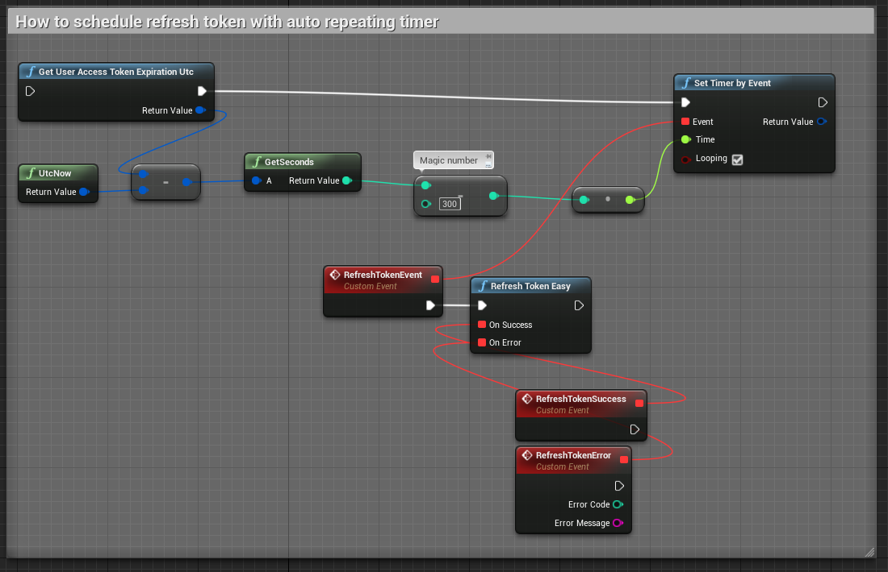
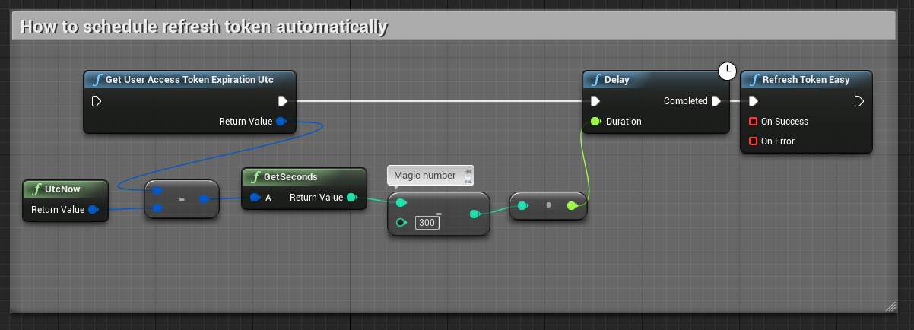

# Tutorial

## User authentication
See AccelByte::Api::UserAuthentication, AccelByte::Api::Oauth2, and AccelByte::Credentials, 

### Login with client credentials
This is to get access token from `client_credentials` grant type, then store the access token in memory. 

It is "required" for user management (create new user, reset password, etc). See AccelByte IAM documentation for how this OAuth2 token endpoint works. We plan to remove this for public clients in the future. It is for servers/confidential clients only.

```cpp
AccelByte::Api::UserAuthentication::LoginWithClientCredentialsEasy(AccelByte::Api::UserAuthentication::FLoginWithClientCredentialsSuccess::CreateLambda([]()
{
    UE_LOG(LogTemp, Log, TEXT("Success"));
}), AccelByte::ErrorDelegate::CreateLambda([](int32 ErrorCode, FString ErrorMessage)
{
    UE_LOG(LogTemp, Log, TEXT("Error: %d %s"), ErrorCode, *ErrorMessage);
}));
```

See AccelByte::Api::UserAuthentication::LoginWithClientCredentials().

### Login with username and password
This is to get access token with Resource Owner Password Credentials (ROPC)/`password` `grant_type` and store it to memory.

```cpp
AccelByte::Api::UserAuthentication::LoginWithUsernameAndPasswordEasy("my.email@gamepublisher.example", "MY SUPER TOP SECRET PASSWORD 123", AccelByte::Api::UserAuthentication::FLoginWithUsernameAndPasswordSuccess::CreateLambda([]()
{
    UE_LOG(LogTemp, Log, TEXT("Success"));
}), AccelByte::ErrorDelegate::CreateLambda([](int32 ErrorCode, FString ErrorMessage)
{
    UE_LOG(LogTemp, Log, TEXT("Error: %d %s"), ErrorCode, *ErrorMessage);
}));
```
See AccelByte::Api::UserAuthentication::LoginWithUsernameAndPassword().

### Login with Steam session ticket
This is to get access token with Steam session ticket. See AccelByte IAM documentation for how this OAuth2 token endpoint works.

```cpp
AccelByte::Api::UserAuthentication::LoginWithOtherPlatformAccountEasy(static_cast<std::underlying_type<AccelByte::Api::UserAuthentication::EPlatformType>>::type>(AccelByte::Api::UserAuthentication::EPlatformType::Steam), "my_steam_session_ticket_blah_blah", AccelByte::Api::UserAuthentication::FLoginWithOtherPlatformAccountSuccess::CreateLambda([]()
{
    UE_LOG(LogTemp, Log, TEXT("Success"));
}), AccelByte::ErrorDelegate::CreateLambda([](int32 ErrorCode, FString ErrorMessage)
{
    UE_LOG(LogTemp, Log, TEXT("Error: %d %s"), ErrorCode, *ErrorMessage);
}));
```
See AccelByte::Api::UserAuthentication::LoginWithOtherPlatformAccount().

### Login with device ID
This is to get access token with device ID and store it, though the device ID defined here is only a call to Unreal Engine 4 [FGenericPlatformMisc::GetDeviceId()](https://api.unrealengine.com/INT/API/Runtime/Core/GenericPlatform/FGenericPlatformMisc/GetDeviceId/index.html). See AccelByte IAM documentation for how this OAuth2 token endpoint works.


```cpp
AccelByte::Api::UserAuthentication::LoginWithDeviceIdEasy(AccelByte::Api::UserAuthentication::FLoginWithDeviceIdSuccess::CreateLambda([]()
{
    UE_LOG(LogTemp, Log, TEXT("Success"));
}), AccelByte::ErrorDelegate::CreateLambda([](int32 ErrorCode, FString ErrorMessage)
{
    UE_LOG(LogTemp, Log, TEXT("Error: %d %s"), ErrorCode, *ErrorMessage);
}));
```
See AccelByte::Api::UserAuthentication::LoginWithDeviceId().

### Login with launcher
The `authorization_code grant_type` in IAM doesn't work yet. Do not use.

### Refresh token
 The access token expires after some time; you need to get new access token with refresh token.
 
```cpp
UserAuthentication::RefreshTokenEasy(UserAuthentication::FRefreshTokenSuccess::CreateLambda([OnSuccess]()
{
    UE_LOG(LogTemp, Log, TEXT("Success"));
}),
	FErrorHandler::CreateLambda([OnError](int32 ErrorCode, FString ErrorMessage)
{
    UE_LOG(LogTemp, Log, TEXT("Error: %d %s"), ErrorCode, *ErrorMessage);
}));
```

See AccelByte::Api::UserAuthentication::RefreshToken().

You can refresh token automatically before it expired with AccelByte::Credentials::GetUserAccessTokenExpirationUtc(). For example, see below.

**Auto refresh token with timer**


**Auto refresh token with delay**


### Logout
This simply remove the stored access tokens and user ID from memory.

```cpp
AccelByte::Api::UserAuthentication::ForgetAllCredentials();
```

See AccelByte::Api::UserAuthentication::ForgetAllCredentials().

## User management
See AccelByte::Api::UserManagement.

### Create user account
Create a new user account.

```cpp
AccelByte::Api::UserManagement::CreateUserAccountEasy("my.email@gamepublisher.example", "MY SUPER TOP SECRET PASSWORD 123", "Example", AccelByte::Api::UserManagement::FCreateUserAccountSuccess::CreateLambda([](const FAccelByteModelsUserCreateResponse& Result)
{
    MyUser = Result.UserId;
    UE_LOG(LogTemp, Log, TEXT("Success"));
}), AccelByte::ErrorDelegate::CreateLambda([](int32 ErrorCode, FString ErrorMessage)
{
    UE_LOG(LogTemp, Log, TEXT("Fail: %d %s"), ErrorCode, *ErrorMessage);
}));
```
See AccelByte::Api::UserManagement::CreateUserAccount().

### Send email verification code 
Send a verification code to user email address.

```cpp
AccelByte::Api::UserManagement::SendUserAccountVerificationCodeEasy("my.email@gamepublisher.example", AccelByte::Api::UserManagement::FSendUserAccountVerificationCodeSuccess::CreateLambda([]()
{
    UE_LOG(LogTemp, Log, TEXT("Success"));
}), AccelByte::ErrorDelegate::CreateLambda([&](int32 ErrorCode, FString ErrorMessage)
{
    UE_LOG(LogTemp, Log, TEXT("Error: %d %s"), ErrorCode, *ErrorMessage);
}));
```

See AccelByte::Api::UserManagement::SendUserAccountVerificationCode().

### Verify user account
Verify the email address using the verification code sent to user's email address. User must log in first to get a access token.

```cpp
AccelByte::Api::UserManagement::VerifyUserAccountEasy("123456", AccelByte::Api::UserManagement::FVerifyUserAccountSuccess::CreateLambda([]()
{
    UE_LOG(LogTemp, Log, TEXT("Success"));
}), AccelByte::ErrorDelegate::CreateLambda([](int32 ErrorCode, FString ErrorMessage)
{
    UE_LOG(LogTemp, Log, TEXT("Fail: %d %s"), ErrorCode, *ErrorMessage);
}));
```

See AccelByte::Api::UserManagement::VerifyUserAccount().

### Send password reset code 
For a password reset, verification code is sent to the email.

```cpp
AccelByte::Api::UserManagement::SendPasswordResetCodeEasy("my.email@gamepublisher.example", AccelByte::Api::UserManagement::FSendPasswordResetCodeSuccess::CreateLambda([]()
{
    UE_LOG(LogTemp, Log, TEXT("Success"));
}), AccelByte::ErrorDelegate::CreateLambda([&](int32 ErrorCode, FString ErrorMessage)
{
    UE_LOG(LogTemp, Log, TEXT("Error: %d %s"), ErrorCode, *ErrorMessage);
}));
```

See AccelByte::Api::UserManagement::SendPasswordResetCode().

### Reset password
Verify the password reset request with the verification code sent to email.

```cpp
AccelByte::Api::UserManagement::ResetPasswordEasy("my.email@gamepublisher.example", "123456", "MY NEW PASSwORD IS MORE TOP SECRET 123", AccelByte::Api::UserManagement::FResetPasswordSuccess::CreateLambda([]()
{
    UE_LOG(LogTemp, Log, TEXT("Success"));
}), AccelByte::ErrorDelegate::CreateLambda([](int32 ErrorCode, FString ErrorMessage)
{
    UE_LOG(LogTemp, Log, TEXT("Error: %d %s"), ErrorCode, *ErrorMessage);
}));
```

See AccelByte::Api::UserManagement::ResetPassword().

## User profile

### Get user profile
Get profile from specified user. The result is FAccelByteModelsUserProfileInfo.

```cpp
AccelByte::Api::UserProfile::GetUserProfileEasy(AccelByte::Api::UserProfile::FGetUserProfileSuccess::CreateLambda([](const FAccelByteModelsUserProfileInfo& Result)
{
    UE_LOG(LogTemp, Log, TEXT("Success"));
    UE_LOG(LogTemp, Log, TEXT("Welcome, %s %s"), *Result.FirstName, *Result.LastName);
}), AccelByte::ErrorDelegate::CreateLambda([](int32 ErrorCode, FString ErrorMessage)
{
    UE_LOG(LogTemp, Log, TEXT("Error: %d %s"), ErrorCode, *ErrorMessage);
}));
```

See AccelByte::Api::UserProfile::GetUserProfile().

### Update user profile
Update profile for a specified user. The parameter is FAccelByteModelsProfileUpdateRequest.

```cpp
FAccelByteModelsUserProfileInfoUpdate ProfileUpdateRequest;
ProfileUpdateRequest.Country = "US";
ProfileUpdateRequest.Language = "en";
ProfileUpdateRequest.Timezone = "Etc/UTC";
ProfileUpdateRequest.DateOfBirth = "2000-01-01";
ProfileUpdateRequest.Email = "new.my.email@gamepublisher.example";
ProfileUpdateRequest.DisplayName = "My New Display Name Example";

AccelByte::Api::UserProfile::UpdateUserProfileEasy(ProfileUpdateRequest, AccelByte::Api::UserProfile::FUpdateUserProfileEasySuccess::CreateLambda([]()
{
    UE_LOG(LogTemp, Log, TEXT("Success"));
}), AccelByte::ErrorDelegate::CreateLambda([](int32 ErrorCode, FString ErrorMessage)
{
    UE_LOG(LogTemp, Log, TEXT("Error: %d %s"), ErrorCode, *ErrorMessage);
}));
```

See AccelByte::Api::UserProfile::UpdateUserProfile().

### Create user profile
Create profile for a specified user. The parameter is FAccelByteModelsProfileCreateRequest.

```cpp
FAccelByteModelsProfileCreateRequest ProfileCreateRequest;
ProfileCreateRequest.Country = "US";
ProfileCreateRequest.Language = "en";
ProfileCreateRequest.Timezone = "Etc/UTC";
ProfileCreateRequest.DateOfBirth = "2000-01-01";
ProfileCreateRequest.Email = "new.my.email@gamepublisher.example";
ProfileCreateRequest.DisplayName = "My New Display Name Example";

AccelByte::Api::UserProfile::CreateUserProfileEasy(ProfileCreateRequest, AccelByte::Api::UserProfile::FCreateUserProfileEasySuccess::CreateLambda([]()
{
    UE_LOG(LogTemp, Log, TEXT("Success"));
}), AccelByte::ErrorDelegate::CreateLambda([](int32 ErrorCode, FString ErrorMessage)
{
    UE_LOG(LogTemp, Log, TEXT("Error: %d %s"), ErrorCode, *ErrorMessage);
}));
```

See AccelByte::Api::UserProfile::CreateUserProfile().

## Ecommerce
API related to Ecommerce.

**Examples coming soon™® (tm). "Coming soon" is a registered trademark of AccelByte, Inc.**

### Categories
The category has [tree data structure](https://en.wikipedia.org/wiki/Tree_(data_structure)). Each category has path, for example "/equipments/armor/legs". Each category has items inside it. You can get a list of items by criteria or by its ID.

#### Get root categories
This is equivalent of getting categories in "/". This will yield, for example, "/equipments", "/consumables", "/pay2win", "/boosts".

#### Get category
This is to get one category with the specified path, for example, "/equipments/armor/torso".

#### Get child categories
This is to get the children of a category by category path.

#### Get descendant categories
This is to get the descendants of a category by category path.

### Items
An item represents a single product sold in the online store.

#### Get item ID
Get one item by its ID.

#### Get items by criteria
Get a list of item matching the criteria. You can think of it like a SQL query.

### Order
Order is used to purchase something from the online store.

#### Get order
Get a single order with order number.

#### Get orders
Get user's orders.

#### Get order history
Get order history of a specified user.

#### Fulfill order
Fulfill an order if the order is charged but the fulfillment fail.

### Wallet
A wallet can be virtual or real curreny.

#### Get wallet by currency code
This is to get wallet by its currency code.

## Lobby
Lobby is for chatting and party management. Unlike other servers which use HTTP, Lobby server uses WebSocket ([RFC 6455](https://tools.ietf.org/html/rfc6455)).

### Connect to server
You must connect to the server before you can start sending/receiving. Also make sure you have logged in first as this operation requires access token.

```cpp
AccelByte::Api::Lobby::Connect(OnSuccess, OnError, OnConnectionClosed);
```

### Disconnect from server
Disconnect from server if and only if the you have connected to server. If not currently connected, then this does nothing.
```cpp
AccelByte::Api::Lobby::Disconnect();
```

### Check if connected
Check whether the connection has been established with the server.
```cpp
if (AccelByte::Api::Lobby::IsConnected())
{
    UE_LOG(LogTemp, Log, TEXT("Yay."));
}
else
{
    UE_LOG(LogTemp, Log, TEXT("Nay."));
}
```

### Sending ping
You should send ping every some time (for example every 4 seconds) so that the server doesn't close the connection.

```
AccelByte::Api::Lobby::SendPing();
```

### Bind delegates
 You must bind delegates/callbacks first to handle the events. For example when a user received a private message or a response to create party request. A delegate which ends with Notice means that it's like a notification, while one which ends with Response means it's like a response to a request. The delegates can be `nullptr` if you want to not bind the callback. All delegates have one parameter `Result` with different types.
```cpp
AccelByte::Api::Lobby::BindDelegates(
    OnPrivateMessageNotice, // Called when a private message was received.
    OnPartyMessageNotice, // Called when a party message was received
    OnInfoPartyResponse, // Called when server has responsed to "get party information"
    OnCreatePartyResponse, //  Called when server has responsed to "create party"
    OnLeavePartyResponse, // Called when server has responsed to "leave party" 
    OnInviteToPartyResponse, // Called when server has responded to "accept a party invitation"
    OnPartyInvitationNotice, // Called when you receive an invitation to join other's party.
    OnAcceptInvitationResponse,  // Called when server has responsed to "accept a party invitation".
    OnPartyInvitationAcceptanceNotice, //  Called when your party invitation has been accepted.
    OnKickPartyMemberResponse, // Called when server has responded to "kick a party member".
    OnGotKickedNoticeFromParty, // Called when you got kicked from party.
    OnGetOnlineUsersResponse // Called when server has responsed to "get online users".
);
```

### Unbind delegates
Unbind all callbacks.
```cpp
AccelByte::Api::Lobby::UnbindDelegates();
```

### Party chat
Send a party chat.
```cpp
AccelByte::Api::Lobby::SendPartyMessage(TEXT("Hello, my party."));
```

### Private message (PM)
Send a private message. Note that the `UserId` format in IAM is just a GUID without hyphens. The `UserId` used here is just for examples.
```cpp
AccelByte::Api::Lobby::SendPrivateMessage(TEXT("Bahamut"), TEXT("Hello, Bahamut."));
```

### Get party information
Get information about current party.
```cpp
AccelByte::Api::Lobby::SendInfoPartyRequest();
```

### Create a party
Create a party. You can't create a party when you're already in one.
```cpp
AccelByte::Api::Lobby::SendCreatePartyRequest();
```

### Leave current party
Leave current a party. You can't leave party when you're not in one.
```cpp
AccelByte::Api::Lobby::SendLeavePartyRequest();
```

### Invite someone to party
Invite someone to party.
```cpp
AccelByte::Api::Lobby::SendInviteToPartyRequest(TEXT("Bahamut"));
```

### Accept a party invitation
Invite someone to party. `PartyId` and `InvitationToken` are from the invitation notice.
```cpp
AccelByte::Api::Lobby::SendAcceptInvitationRequest(TEXT("Bahamut's Party"), TEXT("Random text from the invitation notice"));
```

### Kick a party member
Only party leader can kick a party member.
```cpp
AccelByte::Api::Lobby::SendKickPartyMemberRequest(TEXT("Behemoth"));
```

### Get all online users
Get a list of all online users in the Lobby server.
```cpp
AccelByte::Api::Lobby::SendGetOnlineUsersRequest();
```
