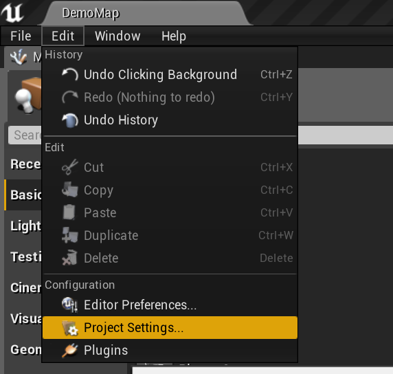
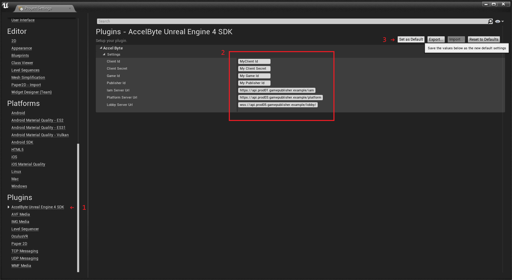

# AccelByte Unreal SDK

AccelByte Unreal SDK is a plugin for Unreal Engine. 

## Assumptions

This documentation assumes that you are already familiar with modern C++, Unreal Engine, HTTP, REST API, microservice architecture, OAuth2, OpenID Connect, JWT, WebSocket.

## Dependencies

AccelByte SDK is compatible with these AccelByte Services version 3.2.0

## Features

AccelByte Unreal SDK features:

- Access the API from C++ and blueprint. C++
- Provides easy-to-use client APIs for:
  - User authentication (access tokens stored in memory)
  - User management (create user, reset password, verify user.)
  - User profile (create, update, view).
  - Ecommerce (get item categories, get items, create orders, etc.)
  - Lobby (chatting, party management)
- Server API.
- Supported Unreal versions: 4.25 - 4.26

## Architecture

The classes are categorized as follow:

- The `Model` classes are used for JSON deserialization and serialization using Unreal Engine [JsonUtilities.h](https://api.unrealengine.com/INT/API/Runtime/JsonUtilities/).
- The `Api` classes provides interface to C++ functions.
- The `Blueprint` classes are simple _glue code_ to provide interface to Unreal Engine Blueprint.
- The `Core` classes are for core functionalities (error handler, settings, credential store, and HTTP retry system). 

## Packaging

- `/Plugins` The actual plugin is located in `/Plugins/AccelByteUe4Sdk`.
- `/Content` This contains example widget blueprints and other asset.
- `/Source` This contains C++ source code for the examples.
- `/Documentation` This contains Doxyfile and this documentation.
  
## Terminology

> There are only two hard things in Computer Science: cache invalidation and naming things. ―Phil Karlton

### `Namespace` vs `GameId` vs `PublisherId`

The backend call it `namespace`, but since namespace can be many things, in here it's called `GameId` and `PublisherId`. They are like AppId in Steam, ProductId in GOG, GameId in GameSparks, TitleId in PlayFab. 

### `UserId` vs `LoginId` vs `Username`

The backend call it `LoginId`, but in here it's called username. It can be email address or phone number. `UserId` is the user unique ID.

### AccelByte IAM

The AccelByte IAM is an identity and access management service for online video games.

It is written in Go.

### AccelByte Platform

AccelByte Platform is a platform service for online video games.

These modules are written in Java to take advantage of the rich eco-system of libraries, mature development environment and tools, and rapid development and flexibility and customization.

### AccelByte Lobby

AccelByte Lobby is for chatting and party management. Unlike other servers which use HTTP, Lobby server uses WebSocket (RFC 6455).

It is also written in Go.

# Quickstart Guide

Here's how to get it up and running quickly.

## Setup

1. The first step is to download and install [Visual Studio 2019](https://visualstudio.microsoft.com/downloads/).

2. Download and install [Unreal Engine 4.25](https://www.unrealengine.com).

3. If you want to run the examples, skip to step 7.

4. Create or open existing Unreal Engine project.

5. Copy the plugin folder `Plugins/AccelByteUe4Sdk` to your game's plugins folder. 

6. Add the plugin to your `/MyAwesomeGame.uproject` file,
```java
"Plugins": [
...
{
    "Name": "AccelByteUe4Sdk",
    "Enabled": true
},
...
```
in `/Source/MyAwesomeGame.Target.cs`, and in `/Source/MyAwesomeGameEditor.Target.cs`.
```cs
ExtraModuleNames.AddRange(new string[]
{
    ...
    "AccelByteUe4Sdk",
    ...
}
```
also in `/Source/MyAwesomeGame/MyAwesomeGame.Build.cs`.
```cs
 PublicDependencyModuleNames.AddRange(
			new string[] {
				...
                "AccelByteUe4Sdk",
                ...
            }
```
7. Open Unreal Editor and click File -> Project Settings.


8. Fill out the settings then click on set as default. The settings will be saved to `DefaultEngine.ini`.


# Blueprint

**Note**: We have halted support for blueprints, new features will be added with no blueprint. Please contact us if you want to use new features on the blueprints.

Supported features:
* Achievement
* Could Storage
* Entitlement
* Store Category
* Store Item
* Lobby
* Order
* Statistic
* User
* Wallet

# Commit Message Standardization

We are following Conventional Commits as a standard to follow for writing commit messages. The details of the rules can be found in the [conventional commits website](https://www.conventionalcommits.org/en/v1.0.0/). 
