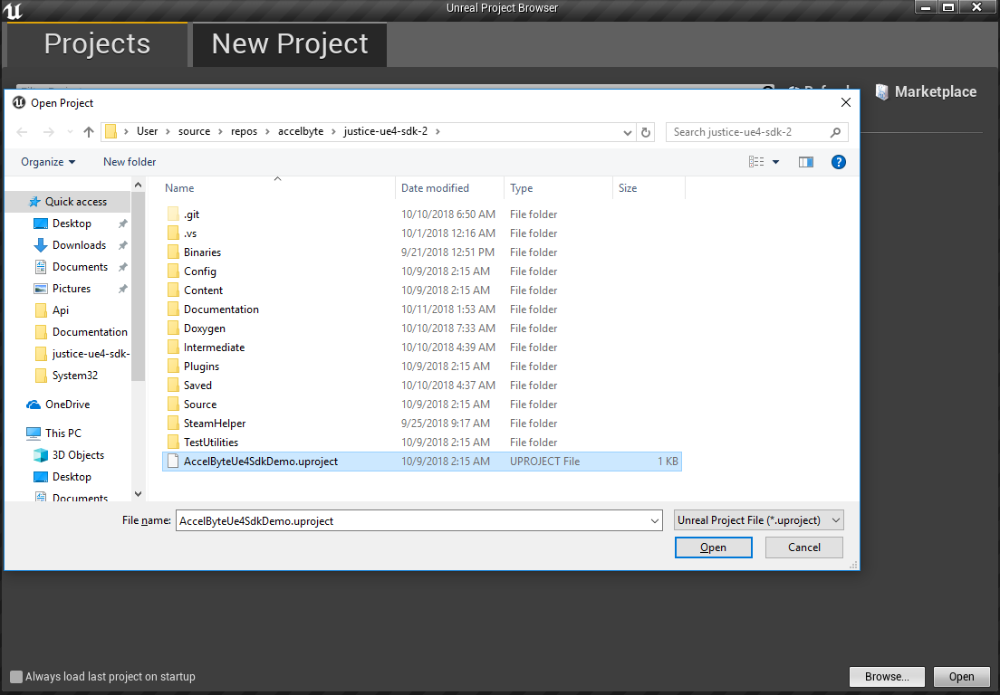
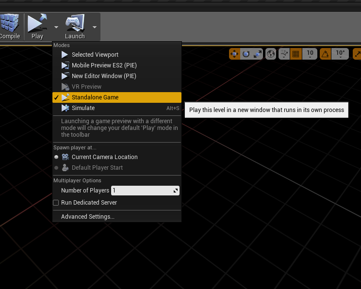
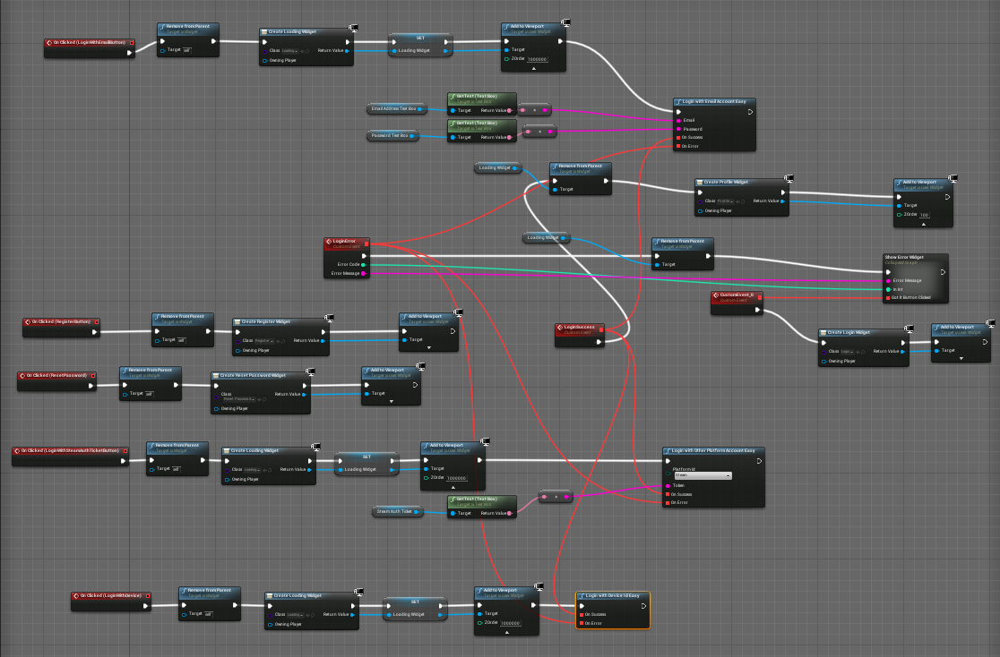
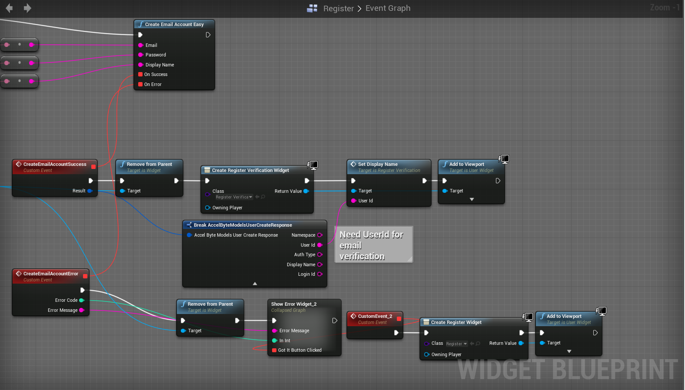
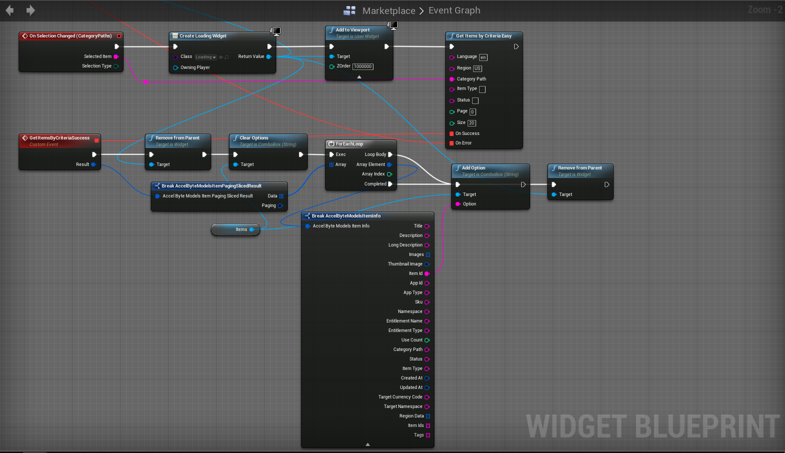
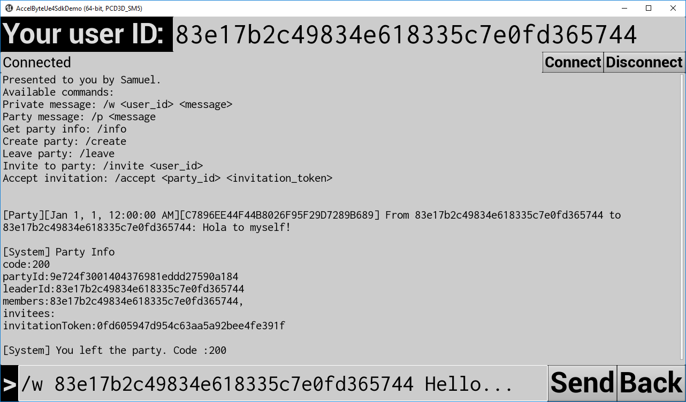

# AccelByte UE4 SDK

AccelByte UE4 SDK is a plugin for Unreal Engine 4.

## Assumptions

This documentation assumes that you are already familiar with modern C++, Unreal Engine 4 (including Blueprint), HTTP, REST API, microservice architecture, OAuth2, OpenID Connect, JWT, WebSocket.

## Dependencies

AccelByte SDK is compatible with these AccelByte backend services:

| Service              | Version              |
|----------------------|----------------------|
| IAM                  | v3.23.0              |
| Platform/E-Commerce  | v3.11.0              |
| Basic                | v1.13.0              |
| social-service       | v1.7.0               |
| lobby-server         | v1.15.0              |

## Features

AccelByte UE4 SDK features:

- Access the API from C++ and blueprint. C++
- Provides easy-to-use client APIs for:
  - User authentication (access tokens stored in memory)
  - User management (create user, reset password, verify user.)
  - User profile (create, update, view).
  - Ecommerce (get item categories, get items, create orders, etc.)
  - Lobby (chatting, party management)
- Maybe server API in the future.

## Architecture

The classes are categorized as follow:

- The `Model` classes are used for JSON deserialization and serialization using Unreal Engine 4 [JsonUtilities.h](https://api.unrealengine.com/INT/API/Runtime/JsonUtilities/).
- The `Api` classes provides interface to C++ functions.
- The `Blueprint` classes are simple _glue code_ to provide interface to Unreal Engine 4 Blueprint.
- The `Core` classes are for core functionalities (error handler, settings, credential store, and HTTP retry system). 

## Packaging

- `/Plugins` The actual plugin is located in `/Plugins/AccelByteUe4Sdk`. The custom web browser widget plugin `/Plugins/AccelByteCustomWebBrowserWidget` is experimental and untested. Please don't use.
- `/Content` This contains example widget blueprints and other asset.
- `/Source` This contains C++ source code for the examples.
- `/Documentation` This contains Doxyfile and this documentation.
  
## Terminology

> There are only two hard things in Computer Science: cache invalidation and naming things. ―Phil Karlton

### `Namespace` vs `GameId` vs `PublisherId`

The backend call it `namespace`, but since namespace can be many things, in here it's called `GameId` and `PublisherId`. They are like AppId in Steam, ProductId in GOG, GameId in GameSparks, TitleId in PlayFab. 

### `UserId` vs `LoginId` vs `Username`

The backend call it `LoginId`, but in here it's called username. It can be email address or phone number. `UserId` is the user unique ID.

### AccelByte IAM

The AccelByte IAM is an identity and access management service for online video games.

It is written in Go.

### AccelByte Platform

AccelByte Platform is a platform service for online video games.

These modules are written in Java to take advantage of the rich eco-system of libraries, mature development environment and tools, and rapid development and flexibility and customization.

### AccelByte Lobby

AccelByte Lobby is for chatting and party management. Unlike other servers which use HTTP, Lobby server uses WebSocket (RFC 6455).

It is also written in Go.

# Quickstart Guide
Here's how to get it up and running quickly.

## Setup

`1.` The first step is to download and install [Visual Studio 2017](https://visualstudio.microsoft.com/downloads/).

`2.` Download and install [Unreal Engine 4.20](https://www.unrealengine.com).

`3.` If you want to run the examples, skip to step 7.

`4.` Create or open existing Unreal Engine 4 project.

`5.` Copy the plugin folder `Plugins/AccelByteUe4Sdk` to your game's plugins folder. 

`6.` Add the plugin to your `/MyAwesomeGame.uproject` file,
```java
"Plugins": [
...
{
    "Name": "AccelByteUe4Sdk",
    "Enabled": true
},
...
```
in `/Source/MyAwesomeGame.Target.cs`, and in `/Source/MyAwesomeGameEditor.Target.cs`.
```cs
ExtraModuleNames.AddRange(new string[]
{
    ...
    "AccelByteUe4Sdk",
    ...
}
```
also in `/Source/MyAwesomeGame/MyAwesomeGame.Build.cs`.
```cs
 PublicDependencyModuleNames.AddRange(
			new string[] {
				...
                "AccelByteUe4Sdk",
                ...
            }
```
`7.` Open the editor, click File -> Project Settings.


`8.` Fill out the settings then click on set as default. The settings will be saved to `DefaultEngine.ini`.


## How to run the examples

Open the `/AccelByteUe4SdkDemo.uproject` in Unreal Engine 4 Editor. 



Play in standalone game mode.



The examples include how to implement the following functionalities in blueprint:

**General**
- Error screen based on numeric error code
- Loading screen

**User authentication**
- Login with client credentials **We are planning to remove this. This is for game server/confidential client only!**
- Login with device ID (anonymous login)
- Login with username and password
- Login with Steam session ticket
- Refresh token
- Logout



**User management**
- Create user account
- Verify user account
- Request password reset
- Verify password reset



**User profile**
- Get user profile
- Update user profile
- Create user profile

**Ecommerce**
- List all categories in an online store
- List all items in a category
- View item information
- Create order



**Lobby**
- Connect to and disconnect from lobby server
- Send ping regularly
- Chat
    - Party chat
    - Private message (PM)
- Party
    - Get information about current party
    - Create a party
    - Leave current party
    - Invite someone to party
    - Accept a party invitation
    - Kick a party member
- Notification
    - Party invitation notice (Someone has invited you to party)
    - Party invitation acceptance notice (someone has accepted your invitation to the party)
Presence
    - Get all online users



# Build Documentation

Install [Doxygen](http://www.doxygen.nl/), go to `/Documentation` folder, and run Doxygen.

```sh
cd Documentation
doxygen
```

The documentation will be in `/Doxygen` folder.
Open `/Doxygen/html/index.html` on your browser.

# Commit Message Standardization
We are following Conventional Commits as a standard to follow for writing commit messages. The details of the rules can be found in the [conventional commits website](https://www.conventionalcommits.org/en/v1.0.0/). 

We optionally provide a git commit-hook that will be triggered when you do a commit through the terminal that will execute an interactive cli that can guide you to write commit message that follows the standard, to enable this, run `make SetupCommitHook`